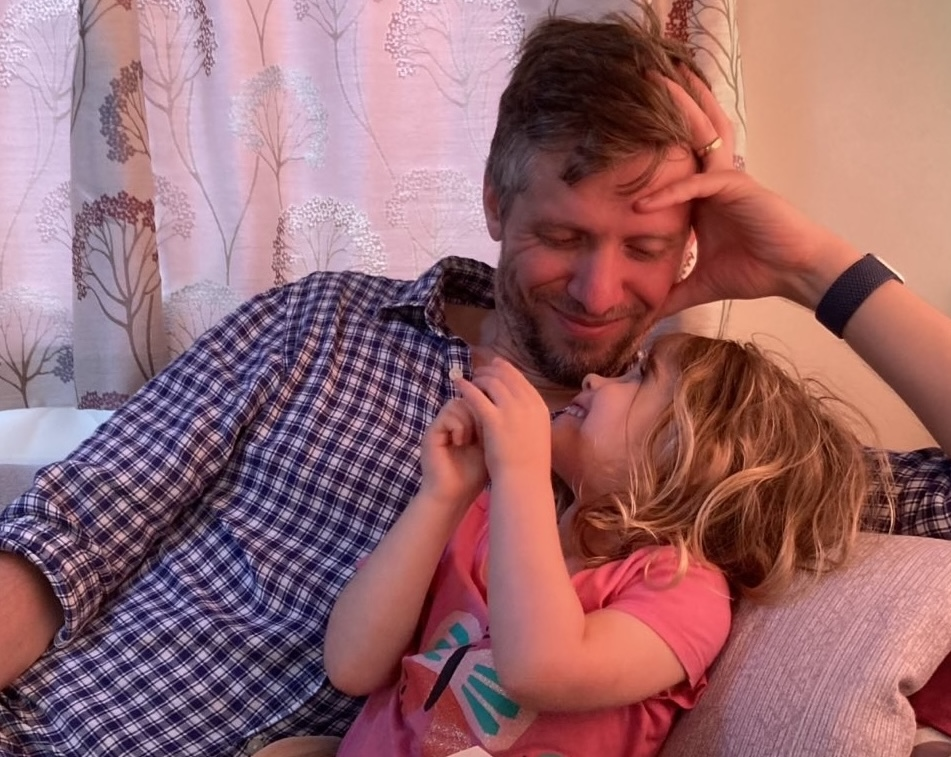

I am a Senior Researcher in Trustworthy Systems at the [Alan Turing Institute](https://www.turing.ac.uk/people/researchers/christopher-burr), in the [Tools, Practices, and Systems](https://www.turing.ac.uk/research/research-programmes/tools-practices-and-systems) programme.
I lead the Innovation and Impact Hub for the [Turing Research and Innovation Cluster in Digital Twins](https://www.turing.ac.uk/research/research-projects/tric-dt). 

My research expertise includes trustworthy AI systems 🤝, digital twinning 🔁, responsible research and innovation ⚖️, data and AI ethics 🤖, and philosophy of cognitive science 🧠.  

Prior to joining the Alan Turing Institute, I was a Postdoctoral Research Associate at the Oxford Internet Institute, University of Oxford.
Before this, I worked at the Department of Computer Science, University of Bristol where I explored the ethical and epistemological impact of big data and artificial intelligence as part of the thinkBIG project.

I completed my PhD in 2017 at the Department of Philosophy, University of Bristol.
My thesis was on embodied decision-making as understood from the perspective of the predictive processing hypothesis.

In general, I think of myself as an interdisciplinary researcher who is passionate about a wide variety of topics.
This creates complications in academic circles, as people typically want to place others inside neat departmental boundaries.
However, it really doesn't do a good job of capturing my interest or expertise.

For instance, I am as happy reading philosophy as I am writing Python.
I enjoy working quietly on qualitative analysis, or running busy participatory design workshops with members of the public or patient groups.
And, I find empirical evidence about how humans make decisions as fascinating as recent studies about the location of concepts in the complex networks of LLMs. 

In short, the following phrase resonates well with how I see myself:

> A jack of all trades is a master of none, but oftentimes better than a master of one.

Finally, and because of the inter- and multi-disciplinary interests, I strongly value _collaboration_.

Working with others from different backgrounds and disciplines has been an eye-opening experience.
Addressing the most important societal challenges cannot be done by one person, team, or organisation—it requires deep, meaningful, and long-lasting collaboration.
Whether it's ensuring diverse voices are included in a longitudinal study, or helping to build sustainable digital research infrastructure, it takes a committed team (and often a supportive and enabling community). 

When I'm not figuring out how to do the above, you can find me swimming 🏊 climbing 🧗 or drinking coffee ☕️
But above all else, my important "research" is the constant and lifelong learning involved with being a loving husband and father!

