# Reimagining Digital Well-Being in an Age of Digital Twins

> [!INFO] Presentation
> This talk was first given at the Future of Digital Well-Being Workshop and Conference 2024, organised by Dr Matthew Dennis and held in Amsterdam.
> 
> Burr, C. (2024). Reimagining Digital Well-Being in an Age of Digital Twins. Future of Digital Well-Being Workshop and Conference, Amsterdam, NL. Zenodo. https://doi.org/10.5281/zenodo.10605135
> 

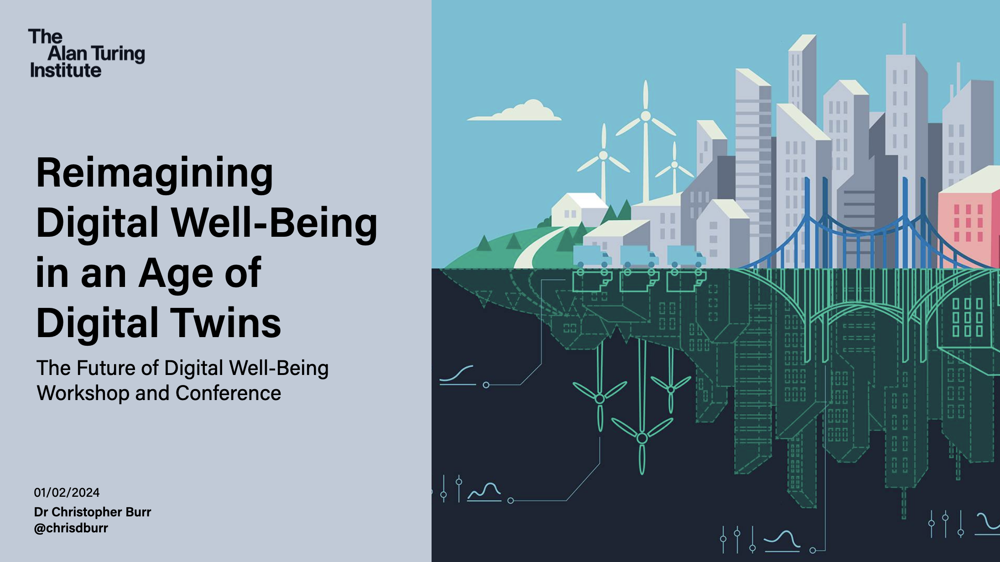

It's been almost 5 years since Matthew Dennis and I were in contact regarding digital well-being. So, I was delighted when he reached out towards the end of 2023 to ask me to participate in this workshop on the Future of Digital Well-Being.

However, as someone who has not actively researched these topics since 2019, Matthew's kind invitation posed a conundrum. What could I talk about without just reusing old material that is now likely out of date in such a fast moving field?

I currently lead the [Innovation and Impact Hub for the Alan Turing Institute's Research and Innovation Cluster in Digital Twins](#). While digital twins are believed by many to have various benefits for individuals and society, and are currently receiving a lot of funding from national agencies and commercial organisations, I had not considered how they would impact well-being directly. 

However, I didn't want to to turn Matthew's invitation down, so I took it as a challenge to spend some time considering the links between my present and past research. This is the entry-point for my presentation.

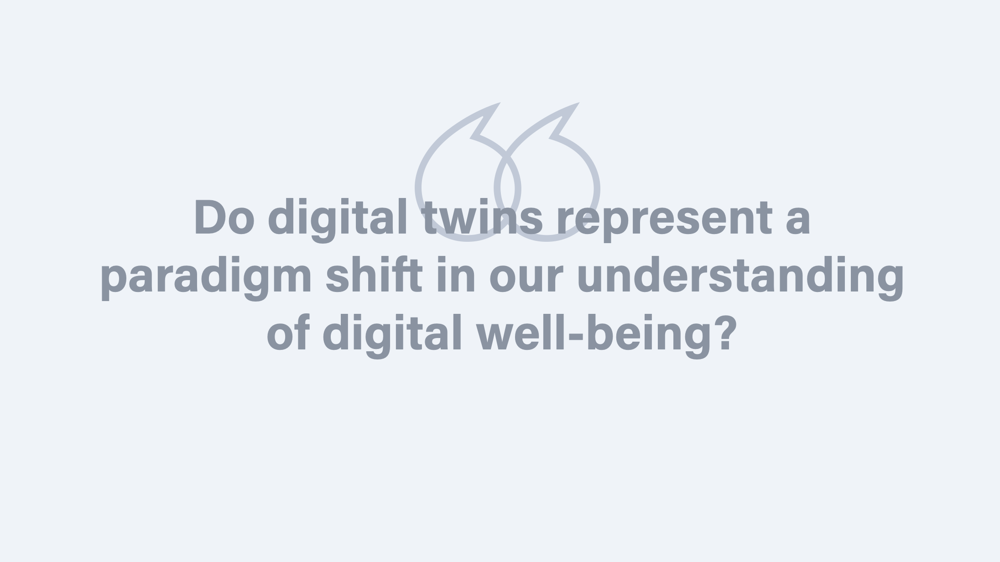

More specifically, I would like to pose the following question as an anchoring point for reflection and discussion. I won’t be aiming at defending an argument or answer to this question, though I will offer a tentative conclusion towards the end of the presentation.

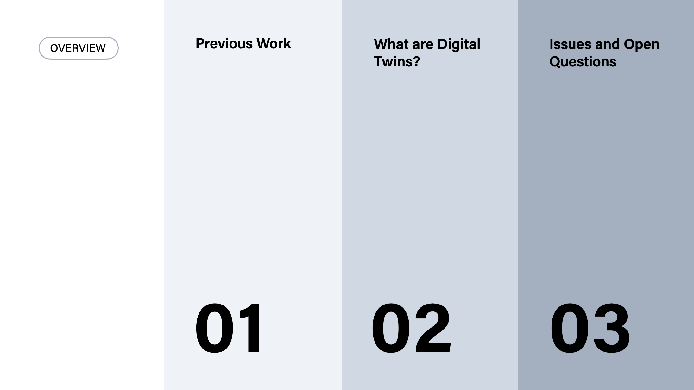

The outline for this presentation is as follows:

- I will start by returning to some of my previous work to pick out several key concepts that were salient when I was originally working on these topics. 
- I will then give a brief introduction to digital twins and digital twinning, for those who are unfamiliar with these concepts.
- Finally, I will conclude with a more philosophical discussion on some important issues and open questions.

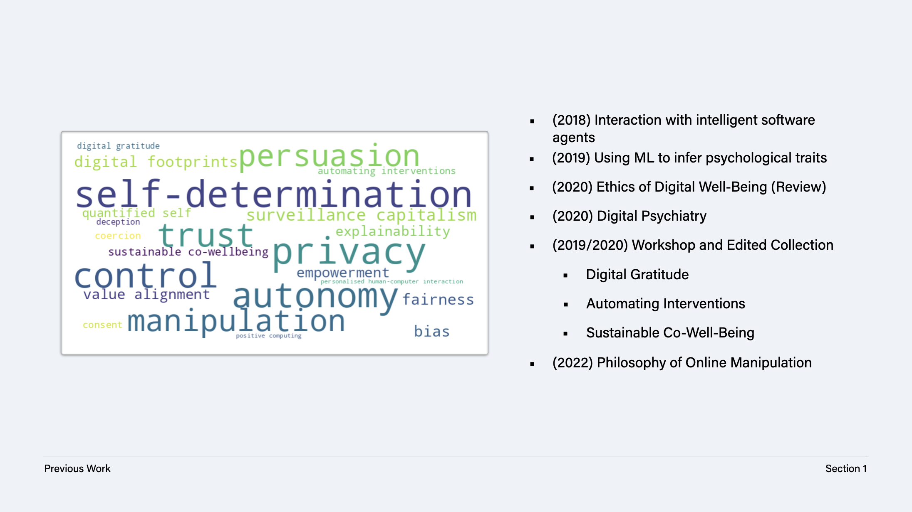

Let’s begin with the some of the salient topics, as I recall them. 

First, back in 2017, when people were beginning to transition from talking about big data as the exciting trend in technology towards AI, I was working with Professor Nello Cristianini and Professor James Layman at the University of Bristol. 

Here, we developed a simple formal model to help identify and analyse some of the ethical challenges associated with “intelligent software agents” [^@burrAnalysisInteractionIntelligent2018]. This term included recommendation systems, such as Facebook’s news feed or YouTube’s video suggestions, which used relevance feedback from user interactions to steer them towards similar content, to personalised adverts that nudged or persuaded people to click, buy, or engage. Concepts such as control and autonomy were crucial to this work.

[^@burrAnalysisInteractionIntelligent2018]: Burr, C., Cristianini, N., & Ladyman, J. (2018). An Analysis of the Interaction Between Intelligent Software Agents and Human Users. _Minds and Machines_, _28_(4), 735–774. [https://doi.org/10.1007/s11023-018-9479-0](https://doi.org/10.1007/s11023-018-9479-0)

On the basis of this research we next explored how various methods could be used to infer psychological traits of users, including personality traits, political and sexual orientation, to psychopathologies [^@burrCanMachinesRead2019]. Again, issues of control arose here, but concepts such as privacy and trust were also at the forefront of concerns.

[^@burrCanMachinesRead2019]: Burr, C., & Cristianini, N. (2019). Can Machines Read our Minds? _Minds and Machines_, _29_(3), 461–494. [https://doi.org/10.1007/s11023-019-09497-4](https://doi.org/10.1007/s11023-019-09497-4)

Following this, I moved to the University of Oxford to work with Professor Luciano Floridi. Here, we focused on “digital well-being” as a concept in its own right, beginning as many research projects do with a literature review of the current landscape [^@burrEthicsDigitalWellBeing2020]. The work of people like Rafael Calvo and Dorian Peters, the latter is here today, heavily shaped and influenced our thematic analysis, bringing the concept of self-determination to the centre of my interests.

[^@burrEthicsDigitalWellBeing2020]: Burr, C., Taddeo, M., & Floridi, L. (2020). The Ethics of Digital Well-Being: A Thematic Review. _Science and Engineering Ethics_. [https://doi.org/10.1007/s11948-020-00175-8](https://doi.org/10.1007/s11948-020-00175-8)

This work continued into a deeper exploration of digital well-being in the context of mental health and healthcare, with a paper that looked at digital psychiatry and drew out 10 lessons that we took to be vital for regulators, policy-makers, designers and developers to consider [^@burrDigitalPsychiatryRisks2020]. 

[^@burrDigitalPsychiatryRisks2020]: Burr, C., J. Morley, M. Taddeo, & L. Floridi. (2020). Digital Psychiatry: Risks and Opportunities for Public Health and Wellbeing. _IEEE Transactions on Technology and Society_, _1_(1), 21–33. [https://doi.org/10.1109/TTS.2020.2977059](https://doi.org/10.1109/TTS.2020.2977059)

This research project culminated in a workshop and edited collection, which Matthew kindly contributed to at the time. In the introduction of this collection, we drew out three themes based on the contributed papers: digital gratitude, automating interventions, and sustainable co-well-being [^@burrEthicsDigitalWellBeing2020a].

[^@burrEthicsDigitalWellBeing2020a]: Burr, C., & Floridi, L. (Eds.). (2020). _Ethics of Digital Well-Being: A Multidisciplinary Approach_ (Vol. 140). Springer International Publishing. [https://doi.org/10.1007/978-3-030-50585-1](https://doi.org/10.1007/978-3-030-50585-1)

Let me say something briefly about the second theme. This topic had concerned me a lot since I began working on these topics. As someone who places a strong value on autonomous and informed decision-making, relocating the nexus of agency (including moral agency) in artificial systems (intelligent or otherwise) is not a choice to take lightly. And, it becomes a highly political and social matter when this choice is dominated by a minority of people or groups in society with disproportionate levels of influence. 

My last real piece of work on these topics was a paper on the Philosophy of Online Manipulation, co-authored with a good friend, Geoff Keeling, who is now at Google [^@keeling2022digital]. Here we explored the idea of manipulation as it pertains to mental integrity—a concept at the time highly under-explored in the literature, despite being a fundamental human right. This paper was completed in 2020, despite the publication only coming out in 2022. 

Keeling, G., & Burr, C. (2022). Digital manipulation and mental integrity. In _The philosophy of online manipulation_ (pp. 253–271). Routledge.

A lot changed in the intervening years.

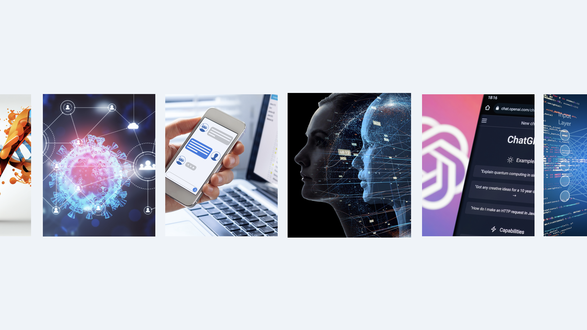

The Covid-19 pandemic and the rise of new forms of AI powered by large language models has undoubtedly changed how we consider, discuss, and understand topics such as digital well-being. I won’t have a lot to say about these events, except for a cursory reflection on multi-agent workflows later in the presentation.

I expect others, however, will have connected work on digital well-being to these disruptive events, and perhaps will discuss their work later this afternoon.

However, I’d like to try to bridge some of the topics explored in my previous work with the area of research that currently dominates my time and attention: digital twins.

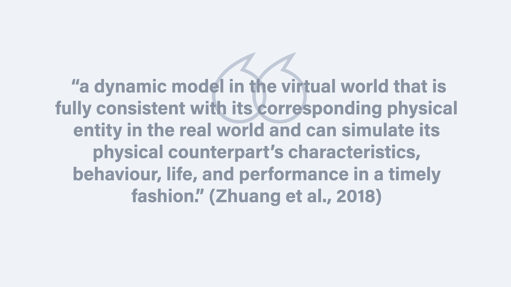

Following the pattern of all good philosophers, let’s start with a definition that we can pick at and unpack. As Zhuang et al. note, a digital twin is

> "a dynamic model in the virtual world that is fully consistent with its corresponding physical entity in the real world and can simulate its physical counterpart’s characteristics, behaviour, life, and performance in a timely fashion.” [^@zhuang2018digital]

[^@zhuang2018digital]: Zhuang, C., Liu, J., & Xiong, H. (2018). Digital twin-based smart production management and control framework for the complex product assembly shop-floor. _The International Journal of Advanced Manufacturing Technology_, _96_, 1149–1163.

This is one definition among many, but it is characteristic of the many.

First, it acknowledges two crucial components: a *virtual model* and the *physical object* or *system* that is represented. The degree of representation here is important, because digital twins are supposed to be highly realistic and representative of the physical system. Timely collection and processing of high fidelity data, it is assumed, is crucial to this. 

Second, the *utility* of the virtual model lies in its ability to provide human users with a means for interacting with a proxy of the physical system, for a variety of purposes. In general, we can capture this utility as informing practical decisions or actions—in other words, interventions, to foreshadow a later critical remark.

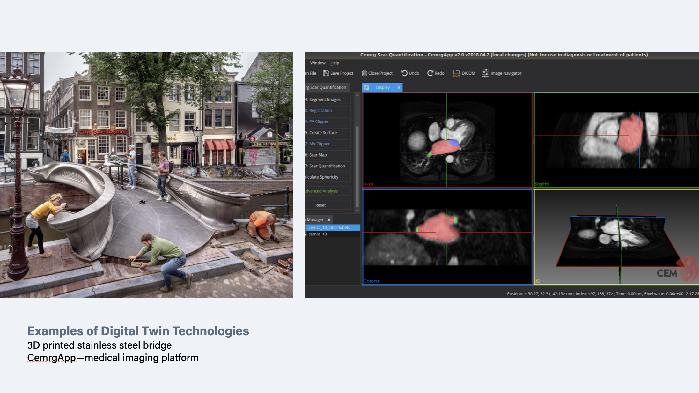

Definitions are helpful, but so are illustrative examples that provide us with an ostensive complement.

It would be remiss of me to come to Amsterdam as a representative of the Alan Turing Institute, and not reference the 3D printed stainless steel bridge that spans the Oudezijds Voorburgwal. 

This bridge was built by the Dutch robotics company, MX3D, in collaboration with researchers at my home institution. When it was still in use, it was embedded with a network of sensors that enabled the bridge to collect data and build a digital twin to keep track of its performance and health.

On the right-hand side of this slide is an picture of the CemrgApp—an interactive medical imaging platform that is being used to research cardiac diseases and treatments that will help doctors and patients approach medical decision-making in a more personalised and participatory manner. 

Digital twins for human health and healthcare are an exciting area of research and innovation. Although not shown here, there is also a project led by Peter Coveney at the Centre for Computational Science (UCL) to scale up digital twinning from hearts to digital twins of full humans.

Needless to say, a digital twin of a bridge, while highly complex, is nowhere near as complex as a digital twin of a human.

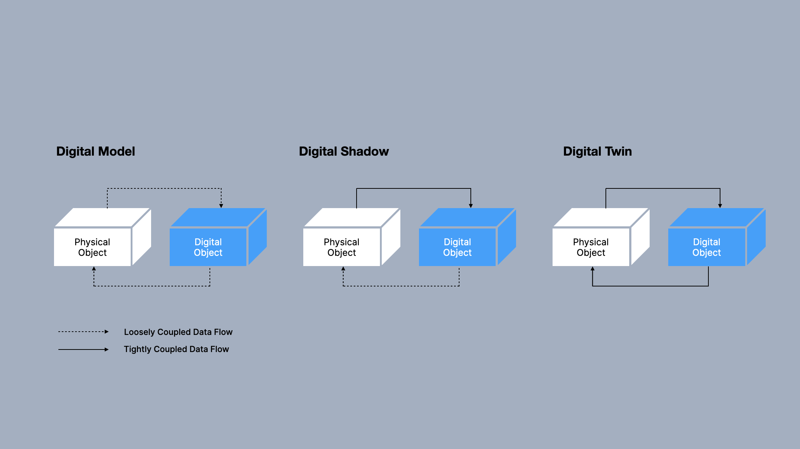

Let’s dig a little bit deeper into the concept of digital twins to help us determine what separates a digital twin from other concepts, such as models or simulations.

First, it is important to note that digital twins are systems. They are not one thing, but can comprise a wide variety of components, sensors, techniques, and processes. This makes their delineation tricky.

However, we can start by acknowledging that a digital twin is not a digital model.

Here, on the left we have an example of a digital model, which represents the corresponding physical object, but where there is only manual or very *loosely coupled* data flow between the two objects. For example, a human may observe and measure some properties of the physical object, record data, and use this data to construct a model. This is the traditional relationship that has dominated much of computational science and modelling to date.

Next, we have what is sometimes referred to as a “digital shadow”. Here, it is expected that there will be an unidirectional flow of data between the physical object and the digital object. For instance, data generated by an IoT sensor that automatically updates a model of a building, such that an alarm could be sounded if a safety-critical variable went out of bounds. However, any actions taken on the basis of this data flow would be decoupled from any subsequent actions or heavily mediated by a human agent.

Finally, we come to the digital twin—a system that is characterised by tightly coupled and bi-directional data flows, which are primarily if not fully automated. Changes in the physical object are monitored, feed into, and update the digital object, which may be governed by instances of AI. More on this shortly. And then actions are taken on the basis of automated decision-making. For instance, altering the humidity of a smart farm to ensure optimal growth of plants.

Moreover, the model may be dynamically reconstructed on the basis of the coupled data flows and evolution of the system over time.

The astute among you may now be wondering why I referred to the 3D printed bridge as a digital twin. After all, how much change can one expect in a largely fixed and unalterable structure?

Let’s separate out the digital shadow and the digital twin for a moment and explore the main point of difference: the data flow from the digital object to the physical object.

At present, a lot of so-called “digital twins” would be best thought of as digital shadows, if we adopt this taxonomy.

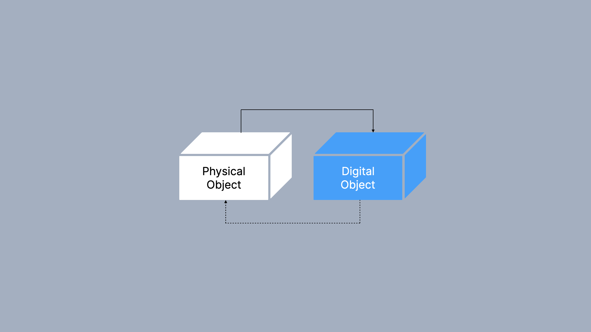

However, there is no consensus on any taxonomy or conceptual framework for digital twins at present[^preprint]. Consensus is still emerging. 

So, what we can refer to as the “degree of coupling” between the digital object and physical object is is highly variable. For instance, a system that has a manual data flow back to the physical object, which takes several months to occur and is managed by humans, is unlikely to be considered a legitimate case of a digital twin. But, what about a situation where the data flow has a human-in-the-loop solely for the purposes of safety assurance? 

As we extend and reduce the degree of coupling, we will invariably cross a vague and fuzzy conceptual boundary between what some think of as digital shadows and others think of as digital twins.

[^preprint]: Though see a recent proposal from our programme and collaborators for some initial thoughts on the development of a philosophical framework for digital twins. Wagg, D., Burr, C., Shepherd, J., Conti, Z. X., Enzer, M., & Niederer, S. (2024). _The philosophical foundations of digital twinning_. Engineering Archive. [https://doi.org/10.31224/3500](https://doi.org/10.31224/3500)

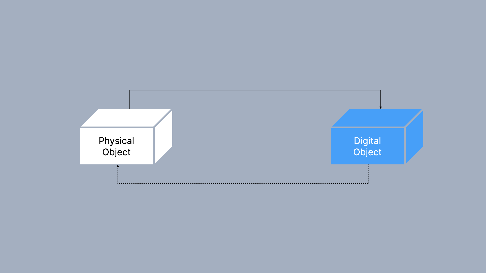

Within this vaguely defined region is where we shall return to our initial topic of digital well-being, and where I shall offer a critical remark about the concept of digital twins.

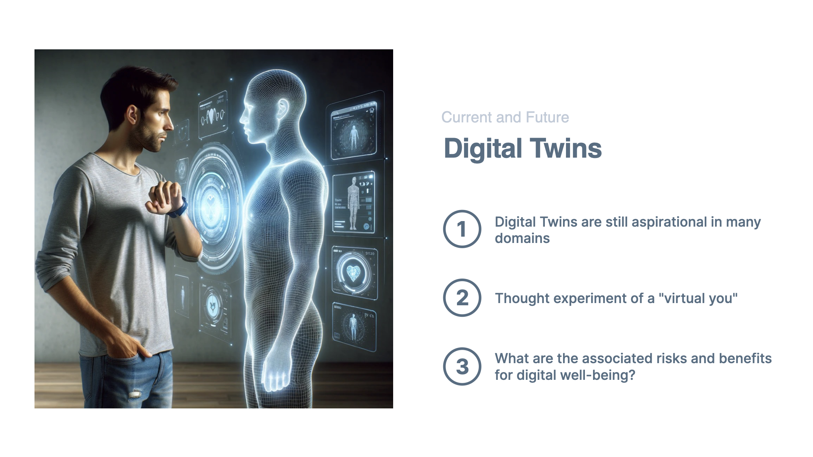

At present, the idea of ‘digital twins’ and ‘digital twinning’ is largely aspirational.

There are few systems that are currently in development or production that would meet strict definitions or criteria for the idealised notion of a digital twin presented on the previous slides. 

However, this workshop and conference is about the “future” of digital well-being, so I shall make the most of the philosophical freedom provided to me and explore a hypothetical scenario—albeit one that is rooted in current technologies.

Consider a digital twin of a person—your own personal assistant, and the sort that those in silicon valley like to pretend are just around the corner as a means to generate hype in foundation models and AI.

Such a digital twin would, we can assume, have high-fidelity and near real-time access to myriad personal health and well-being data from you and a host of relevant sources. 

This data would be used to continuously update the parameters of an associated model, and dynamically reconstruct this personalised model to make recommendations or even take actions on your behalf (e.g. modulating vitamin and mineral composition of your food, adjusting your sleep schedule to ensure “optimal” levels of alertness). 

Healthcare professionals could also access this assistant through secure APIs to run simulations and identify your risk for a variety of illnesses, especially those for which your genetic data suggest a predisposition towards.

Here we can ask, what are the associated issues with such a scenario, focusing primarily on digital well-being?

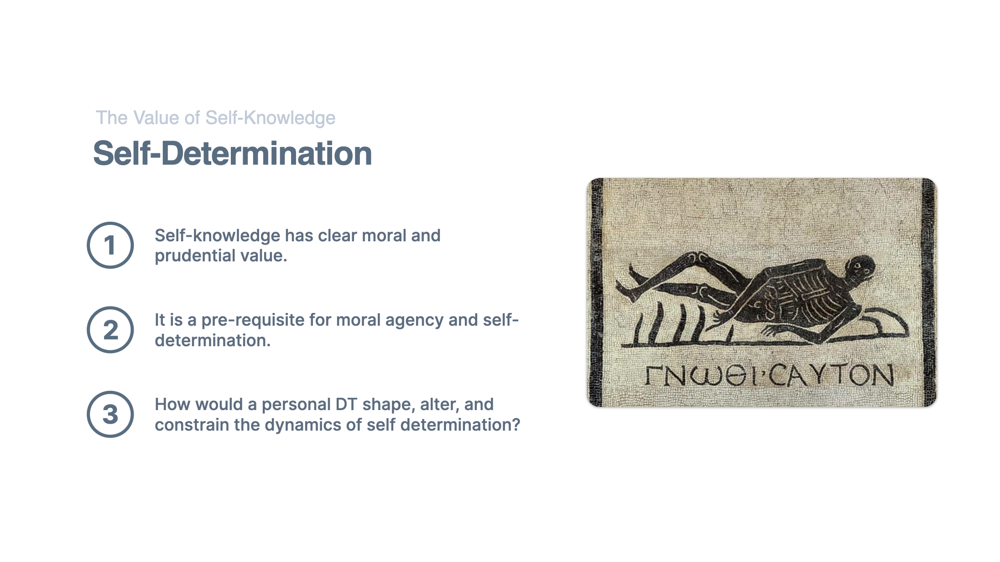

The issue I would like to discuss pertains to self-knowledge and self-determination—a topic that has fascinated us for thousands of years, as evidenced by the famous maxim of “know thyself” that is frequently cited as hanging above the entrance to the famous temple at Delphi in Ancient Greece.

Self-knowledge is understood to have clear moral and prudential value. Without self-knowledge, we cannot undertake the sorts of rational and autonomous decisions that are assumed to be characteristic of genuine moral agents, as opposed, say, to children or animals (i.e. moral patients).

But, the development and use of a digital twin, such as the one proposed in the hypothetical scenario, would disrupt many of the cognitive, behavioural, and interpersonal dynamics that underpin our capacity for self-determination.

Let’s go back to this diagram again and peek inside the black box of the digital object. As you may recall, I noted that a digital twin is not “one thing”. It is a concept that envelops many constitutive components, processes, and techniques.

For instance, the digital object that would analyse and synthesise the data flows from a person (in our hypothetical scenario) could be a highly networked, multi-agent workflow. By this I mean a system of agents, built up from highly-specialised and fine-tuned models of the sorts that are currently being developed by organisations such as OpenAI, Meta, Mistral, and Google.[^autogen]

[^autogen]: See the Microsoft Research project, Autogen, for further details on this idea.

I asked one of these sorts of agents, ChatGPT's DALL-E, to create an image  that captured the vast diversity of microbial life on this planet.

And, then, I asked ChatGPT to create a similar image but this time with the concept of intelligent software agents of the sorts just discussed. Parts of the prompts are displayed below the images for reference.

These images are fascinating to consider and ponder. And as someone who is not artistically very competent, I enjoy how such tools can expand my ability to communicate in a different medium. But despite the creative potential, they are still cartoons, and cartoons aren't typically detailed representations of reality.

The following quote from Jaron Lanier articulates this concern well. 

A prominent and famously critical voice of novel technologies, Lanier wrote a paper titled, ‘Agents of Alienation’ in which he argued that human reliance on AI to curate and mediate our interaction with information not only leads to a narrowing of human experience but also encourages a form of self-diminishment among users [^@lanier1995agents].

[^@lanier1995agents]: Lanier, J. (1995). Agents of alienation. _Interactions_, _2_(3), 66–72.

In this paper he fears that such agents, by pretending to know our preferences and serving us a filtered reality, will inevitably dumb down human interaction and creativity. As he states here, 

> “An agent's model of what you are interested in will be a cartoon model, and you will see a cartoon version of the world through the agent's eyes. It is therefore a self-reinforcing model.”

The observant among you will note that this paper was not published recently, but in 1995. Yet, it's still salient.

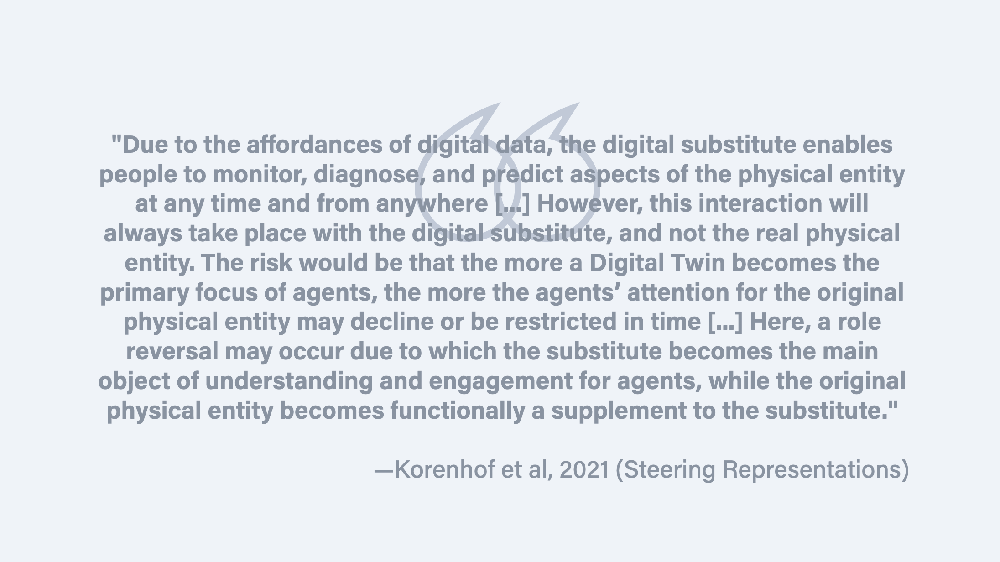

Bringing us closer to the present day, Paulan Korenhof et al. write the following in an article that critically analyses the concept of digital twins:

> "Due to the affordances of digital data, the digital substitute enables people to monitor, diagnose, and predict aspects of the physical entity at any time and from anywhere [...] However, this interaction will always take place with the digital substitute, and not the real physical entity. The risk would be that the more a Digital Twin becomes the primary focus of agents, the more the agents’ attention for the original physical entity may decline or be restricted in time [...] Here, a role reversal may occur due to which the substitute becomes the main object of understanding and engagement for agents, while the original physical entity becomes functionally a supplement to the substitute." [^@korenhof2021]

[^@korenhof2021]: Korenhof, P., Blok, V., & Kloppenburg, S. (2021). Steering Representations—Towards a Critical Understanding of Digital Twins. _Philosophy & Technology_, _34_(4), 1751–1773. [https://doi.org/10.1007/s13347-021-00484-1](https://doi.org/10.1007/s13347-021-00484-1)

Like Lanier, Korenhof et al. critically examine the risk of placing mediating agents between our own perceptual and cognitive capacities and the world itself. 

This is not a new risk, of course. All technological use—as understood by philosophers such as Don Ihde, Merleau-Ponty, or Donna Harraway—affect our experience and engagement with the world, including ourselves and each other.

But the question is whether it is digital twins pose a _sui generis_ risk to our capacity for self-determination?

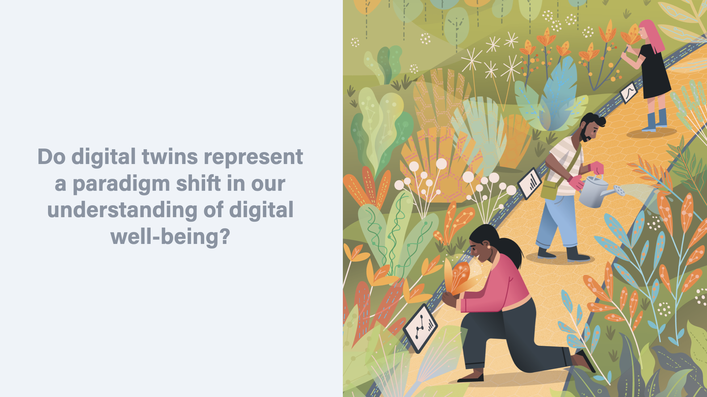

Or, returning, finally, to my original question, “do digital twins represent a paradigm shift in our understanding of digital well-being”?

As I noted at the start, I won’t attempt to answer this fully, but my inclination is “no”. 

The risk that digital twins pose to our well-being is a risk that is tempered by their benefits, as is the case with all technologies that embed the values of their designers, developers, and users. Digital twins are no different. 

However, that does not mean that I don't think there is still a hugely rich and fascinating territory that demands exploration. While the topology and texture of this terrain is probably already fairly well understood, at least in the domain of digital well-being, due to the existence of many generalisable lessons and knowledge, there is always further value that can be created by more detailed examination and exploration.

I hope I have encouraged some of you that such exploration is worthwhile. If not, then thank you at least for listening. 

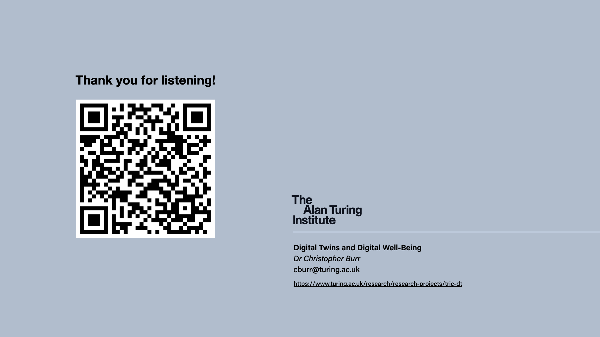